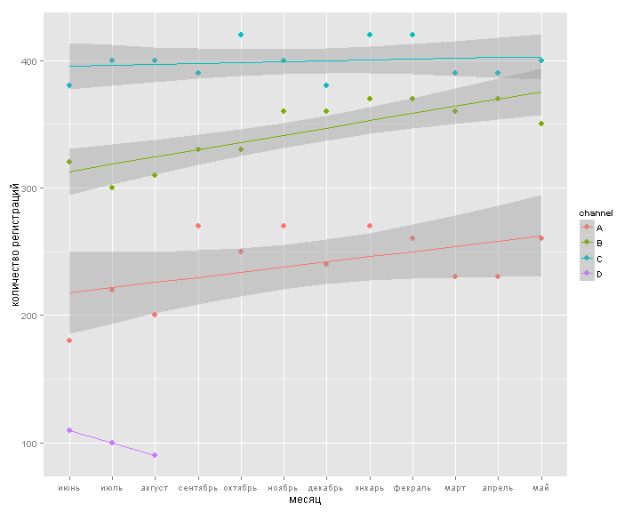
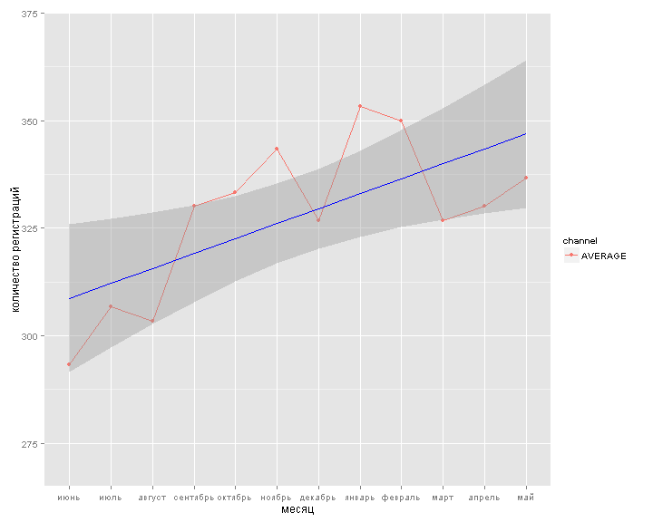

## Прогнозирование эффективности каналов регистрации пользователей.

выполнил: *Григорий Михолап*  
дата: *09/12/2015*


**Задание:**

Существует четыре рекламных канала регистраций пользователей A, B, C и D. В сентябре канал D был удален, и по май включительно существовало только три рекламных канала. В июне предполагается снова ввести рекламный канал D. Необходимо определить будущее значение регистраций на нем в июне. Количество регистраций по периодам на каждом канале представлено в файле “Данные для статобработки.xls” на вкладке “Рекламные каналы”..

**Выводы кратко:** 
Прогноз для остановленного канала выполнен на основании данных о результативности данного канала в первые 3 месяца его работы с учетом тренда (рассчитанного на основании данных по 3-м работающим каналам). Спрогнозированное на июнь количество регистраций равно 135.  Подробности см. в отчете ниже. 

## Загрузка и подготовка данных для анализа
Программный код, который используется в отчете, в т.ч. и некоторые операции (такие как загрузка и подготовка данных для анализа) не были включены в отчет, при необходимости все эти данные вы можете найти [по ссылке](https://github.com/Grag2015/testWG/blob/master/Task%202%20Minsktrans.Rmd) 


## Анализ данных
Посмотрим на средние показатели предоставленных данных   

Показатель  | Канал A | Канал B | Канал С | Канал D | Все каналы
------------- | ------------- | ------------- | ------------- | ------------- | -------------
Среднее число регистраций в месяц | 240 | 344 | 399 | 100 | 328
Среднее отклонение | 29 | 25 | 14 | 10 | 18

Мы видим, что Канал С наиболее результативный, на втором месте канал В, на третьем канал А, канал D, значение по которому предстоит спрогнозировать показал за 3 месяца совсем невысокие показатели, и привел в июне-августе не более 10% от всех регистраций..
Однако, важно отметить, что кроме числа регистраций, необходимо еще учитывать и стоимость привлечения одной регистрации, возможно по этому показателю канал D может быть интересен. Впрочем, анализ эффективности каналов выходит за рамки данного отчета.

Далее, посмотрим на показатели регистрации по каналам во временной динамике (см. диаграмму)
 
Мы видим, что каналы А и В показывают положительную динамику, а лидирующий канал С оставался на одном уровне в течение 12 месяцев. Можно сказать, что в целом наблюдается положительный тренд, посмотрим более внимательно на среднюю регистрацию по каналам А, В и С (см. график ниже) 

 
На данном графике мы видим некоторые сезонные колебания, например, предновогоднее падение в декабре, а также резкое падение в марте. Но, в рамках данной задачи, следует обратить внимание не на сезонные колебания, а на положительный тренд, который обозначен синей линией на графике. 

Данный тренд показывает, что за 12 месяцев (с июня по май) число регистраций выросло на 11%, это свидетельствует о росте популярности нашего сервиса. (при условии, что бюджеты на каналах не увеличивались от месяца к месяцу)

*Замечание*: Данная линейная аппроксимация построена методом наименьших квадратов. 
В таблице представлены показатели данной линейной модели. (как видим, все коэффициенты статистически значимы (p-value<0.05) и поэтому можно утверждать, что данный тренд не случайный)


```
## Residual standard error: 14.2 on 10 degrees of freedom
## Multiple R-squared:   0.4611 Adjusted R-squared:   0.4073
## F-statistic:  8.56 on 1 and 10 DF,  p-value: 0.01516
```
<!-- html table generated in R 3.2.2 by xtable 1.8-0 package -->
<!-- Wed Dec 09 21:43:49 2015 -->
<table border=1>
<tr> <th>  </th> <th> Estimate </th> <th> Std. Error </th> <th> t value </th> <th> Pr(&gt;|t|) </th>  </tr>
  <tr> <td align="right"> (Intercept) </td> <td align="right"> 305.2020 </td> <td align="right"> 8.7380 </td> <td align="right"> 34.93 </td> <td align="right"> 0.0000 </td> </tr>
  <tr> <td align="right"> as.numeric(period) </td> <td align="right"> 3.4732 </td> <td align="right"> 1.1873 </td> <td align="right"> 2.93 </td> <td align="right"> 0.0152 </td> </tr>
   </table>

(все детали доступны [по ссылке]())

Теперь перейдем непосредственно к ответу на исходный вопрос "будущее значение регистраций на канале D в июне". Для оценки искомого значения предлагаю применить к базовому значению наш тренд, за базу предлагаю взять среднее арифметическое по каналу D в июле (оно, кстати, равно среднему за лето по каналу D, что также говорит в пользу нашего выбора), т.о. т.к. тренд выражен линейной функцией, то легко найти **прогноз значения на июнь** - 134.73

Иллюстрация на графике

 

**Результат:** т.о. спрогнозированное на июнь количество регистраций равно 134.73

**Вопросы:**
можно ли оценить точность данного прогноза? (рассчитать какой-нибудь доверительный интервал)
каким образом еще можно спрогнозировать данное значение?
какие факторы еще еще можно учесть в данном прогнозе?
